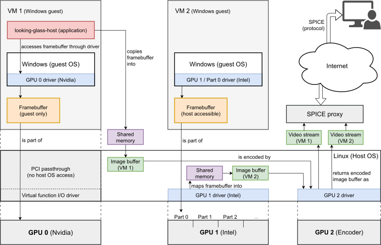

# GPU-accelerated Open Source VDI for OpenStack


## Project description

Starting from summarizing preexisting work and technologies, this project introduces the necessary considerations and steps to develop a fully Open Source Virtual Desktop Infrastructure (OSVDI) on top of OpenStack.
Unlike other already available open-source solutions, a Virtual Desktop Infrastructure (VDI) with access for 3D or video rendering using Graphics Processing Units (GPUs) caters to various use cases like GPU-accelerated desktop environments, remote visualization, or large-scale desktop virtualization.
Such use cases require the integration of special-purpose hardware in cloud servers and the sharing of devices as well as resource scheduling, a user interface for session or resource selection, and efficient remote transport.
The envisioned OSVDI is yet in its infancy growing from previous work to provide efficient large-scale remote access to existing PC pools in the bwLehrpool service for various teaching and learning environments.
This preliminary cloud provides insights and experience to design the necessary (additional) OpenStack components and configurations.


## Planned features

  - Full integration into OpenStack to easily turn a cloud setup into a VDI
  - Mediated GPU passthrough for GPU-accelerated virtual desktop environments
  - Hardware-accelerated and low-latency video encoding for an efficient transport 
  - Desktop transport to a remote (thin) client via the SPICE protocol


## Technical overview



GPU virtualization options and remote transport: Direct GPU passthrough (left) or mediated GPU passthrough (middle) for Windows guests, where a framebuffer (virtual desktop) of each Windows guest is encoded as video stream (right), which is transferred to a remote client using the SPICE protocol.


## Publication list

**Towards a GPU-Accelerated Open Source VDI for OpenStack**  
Manuel Bentele, Dirk von Suchodoletz, Manuel Messner, Simon Rettberg  
Proceedings of the 11th EAI International Conference on Cloud Computing (CloudComp 2021), pages 149-164, 2022.  
DOI: [10.1007/978-3-030-99191-3_12](https://doi.org/10.1007/978-3-030-99191-3_12)

```bibtex
@InProceedings{OpenStackVDI,
    author={Bentele, Manuel and von Suchodoletz, Dirk and Messner, Manuel and Rettberg, Simon},
    editor={Khosravi, Mohammad R. and He, Qiang and Dai, Haipeng},
    title={Towards a GPU-Accelerated Open Source VDI for OpenStack},
    booktitle={Cloud Computing},
    year={2022},
    publisher={Springer International Publishing},
    address={Cham},
    pages={149--164},
    isbn={978-3-030-99191-3},
    doi={10.1007/978-3-030-99191-3_12}
}
```


## License

The OSVDI project is distributed under the [Apache License, Version 2.0](https://www.apache.org/licenses/LICENSE-2.0) to be compatible with all official OpenStack projects. See `LICENSE.md` for more information.


## Acknowledgments

Part of the activities and insights presented in this project were made possible through preliminary work in the bwGPUL project supported by the Baden-Württemberg Ministry of Science, Research, and the Arts, the collaboration in the PePP project (FBM2020-VA-77-8-01241), and the German NFDI initiative (NFDI 7/1).
